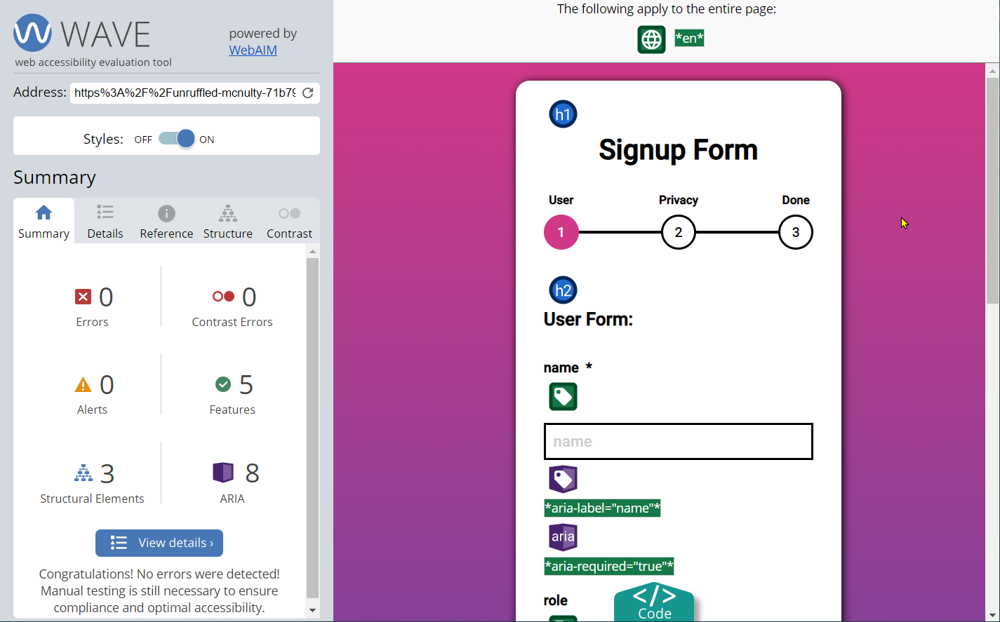

# React Redux Multi-Step Signup Form
__[Live Link](https://unruffled-mcnulty-71b799.netlify.app)__
<br />

Created with React, Redux Toolkit, and SASS. Plus React Lazy Load for Component loading.
<br /><br />

## Questions
### How you would change the configuration of a certain page?
The components allow very easy control via props to change page titles, submit button text, success message and even enable dynamic back buttons too.
<br />

### How you would add new pages?
The app uses a 'views' approach, so new components can easily be added to the signup view page by linking to new components from the components directory. Then also adding them to the progress component in the signup views page too.
<br />

### How you would implement going back a page?
The components feature props to enable/disable a dynamic 'Back' button as outlined in the prop documention below.
<br /><br />


## Features
- Multi-Step Signup Form
- Form Progression Path
- Modular/Scalable App
- Form Validation
- Custom fav icon
- Lazy Loading for image and components
- React Testing Library pass
- PWA testing pass
- Lighthouse testing pass
- HTML testing pass
- CSS testing pass
- Accessibility testing pass
<br />

## Run
````cmd
npm install
npm start
````


## Components

### Form User Signup Component
Component for Signup Page

| Prop Name       | Description           | Example  | Type  |
| ------------- |:-------------:| -----:| -----:|
| pageTitle | form page stage title | {'User Form:'} | `string` |
| submitButtonText | submit next button display text | {'Next'} | `string` |
| previousButton | shows / hides Back button | {false} | `boolean` |

<br />

### Form User Privacy Component
Component for Privacy Page

| Prop Name       | Description           | Example  | Type  |
| ------------- |:-------------:| -----:| -----:|
| pageTitle | form page stage title | {'Privacy Form:'} | `string` |
| submitButtonText | submit next button display text | {'Next'} | `string` |
| previousButton | shows / hides Back button | {true} | `boolean` |

<br />

### Form User Completion Component
Component for Completion Page

| Prop Name       | Description           | Example  | Type  |
| ------------- |:-------------:| -----:| -----:|
| pageTitle | form page stage title | {'Success!'} | `string` |
| successMessage | Success message to display | {'Thanks for your submission'} | `string` |

<br />


## Testing
__React Testing Library__
<br /><br />
run `npm test` to perform testing
<br />
Basic test to check page h1 title loads with test id.
<br />


## Other Testing

__Google Lighthouse__
<br />


__[Accessiblity Testing Link](https://wave.webaim.org/report#/https://unruffled-mcnulty-71b799.netlify.app/)__


__[CSS Testing Link](https://jigsaw.w3.org/css-validator/validator?profile=css3&warning=0&uri=https://unruffled-mcnulty-71b799.netlify.app/)__


__[HTML Testing Link](https://validator.w3.org/nu/?doc=https://unruffled-mcnulty-71b799.netlify.app/)__

